# Exercício 2A

#### Dupla
Daniel Helú Prestes de Oliveira - 166215<br>
Gustavo Fernandez da Costa - 169296

### 1. Ping
1.1. O parâmetro -c faz com que a medição seja realizada apenas para um número de pacotes.<br>

Ex.:
```bash
ping -c 5
```
Faz a medição para a ida e volta de 5 packets.<br>

* RTT para www.google.com: <br>
    **Mínimo:** 14.091ms<br>
    **Média:** 14.210ms<br>
    **Máximo:** 14.279ms<br>

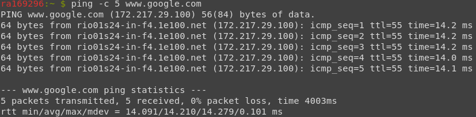

* RTT para www.unicamp.br: <br>
    **Mínimo:** 0.461ms<br>
    **Média:** 0.502ms<br>
    **Máximo:** 0.528ms<br>

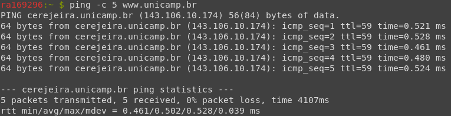

1.2. Há uma grande diferença nos tempos por uma questão de distância física entre os hosts. O servidor da Unicamp é muito mais próximo à máquina do laboratório do que o servidor do Google.

1.3. Ao definir a quantidade de bytes como 496 pelo comando:
```bash
ping -c 5 -s 496 <endereço>
```
Obteve-se para os servidores:

* RTT para www.google.com: <br>
    **Mínimo:** 14.112ms<br>
    **Média:** 14.199ms<br>
    **Máximo:** 14.264ms<br>

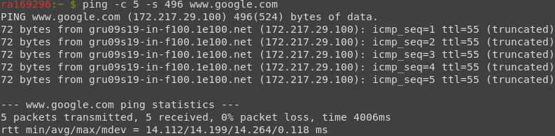

* RTT para www.unicamp.br: <br>
    **Mínimo:** 0.635ms<br>
    **Média:** 0.671ms<br>
    **Máximo:** 0.698ms<br>

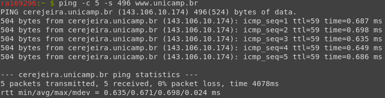

Para os dois servidores houve um pequeno aumento de tempo de ida e volta. No caso da Unicamp, isso se deve pela distância física entre a máquina de trabalho e o servidor ser pequena. No caso do servidor da Google, é possível perceber ao final das respostas de ping o termo: *truncated*. Isso, porque por questões de segurança a empresa limita o número de bytes por pacote enviado. À esquerda podemos ver o verdadeiro número de bytes enviado: 72.

1.4. O host não é alcançado pelo ping, mas pelo navegador é possível acessá-lo. Visto isso podemos ver que o ping, isoladamente, não pode ser considerado uma ferramenta para verificar a disponibilidade de um host.

### 2. Ifconfig

**Interfaces:**
 - _docker0_
   - Bytes Enviados: 0
   - Bytes Recebidos: 0
   - IPv4: 172.17.0.1
   - Endereço Ethernet: 02:42:21:c5:9a:a4
 - _eno1_
   - Bytes Enviados: 2959862512 (2.7 GiB)
   - Bytes Recebidos: 6806770998 (6.3 GiB)
   - IPv4: 143.106.16.41
   - IPv6: fe80::fab1::56ff::fefc::5b63
   - Endereço Ethernet: f8:b1:56:fc:63
 - _lo_
   - Bytes Enviados: 140
   - Bytes Recebidos: 140
   - IPv4: 127.0.0.1
   - IPv6: ::1
 - _virbr0_
   - Bytes Enviados: 0
   - Bytes Recebidos: 0
   - IPv4: 192.168.122.1
   - Endereço Ethernet: 52:54:00:c7:84:7d

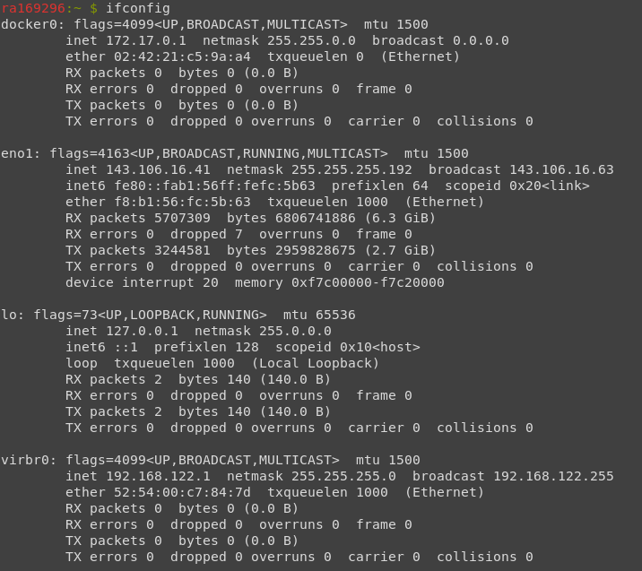

### 3. Route

Estão definidas 5 rotas. Os pacotes seguem para a interface _eno1_.

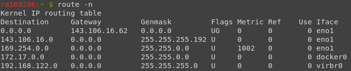

### 4. Nslookup

4.1. Obteve-se os IPs: 31.13.85.38 e 2a03:2880:f105:86:face:b00c:0:50fb. As vantagens de ter mais de um endereço IP são transferir um endereço IP para outro host que permite evitar a queda do serviço por manutenção ou falha, e permitir múltiplas requisições de um usuário acessando IPs diferentes. É possível observar na imagem que o DNS configurado na estação é monica.lab.ic.unicamp.br.

4.2. O nome relacionado a este IP é o _localhost_. Ele está relacionado com a interface _loopback_ e pode ser usado por aplicações TCP/IP para testarem a comunicação consigo mesmas.

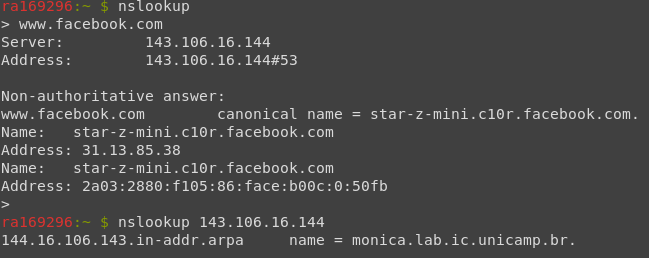


### 5. Traceroute
\*A partir desse exercício os comandos foram executados na máquina "Tramp" do laboratório, não na "Mônica" como anteriormente.

5.1. Há 19 roteadores entre a estação de trabalho e o host www.ethz.ch. Os localizados no Brasil são identificados pelo ".br" no fim do endereço, além daqueles que os antecedem. São eles:

 1  gateway (143.106.16.62)  0.794 ms  0.760 ms  1.092 ms <br>
 2  172.16.10.253 (172.16.10.253)  0.715 ms  0.708 ms  1.041 ms <br>
 3  area3-gw.unicamp.br (143.106.1.129)  0.658 ms  0.642 ms  0.627 ms <br>
 4  ptp-ncc-nbs.unicamp.br (143.106.199.9)  0.614 ms  0.599 ms * <br>
 6  sp-sp2.bkb.rnp.br <br>

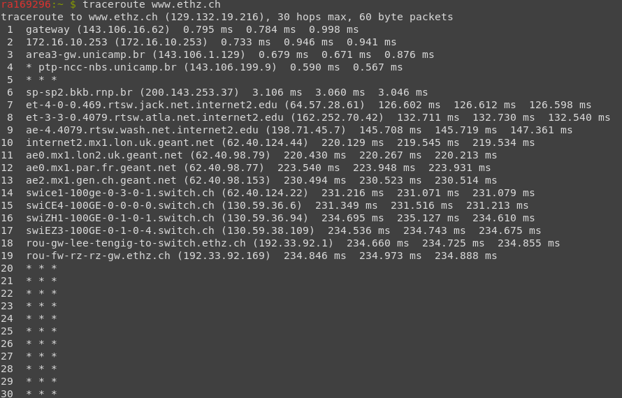

5.2. Há 20 roteadores entre a estação de trabalho e o host www.cam.ac.uk. Aqueles em comum com o host anterior são:

1  gateway (143.106.16.62)  0.707 ms  0.707 ms  0.954 ms <br>
2  172.16.10.253 (172.16.10.253)  0.668 ms  0.911 ms  0.908 ms <br>
3  area3-gw.unicamp.br (143.106.1.129)  0.624 ms  0.615 ms  0.856 ms <br>
4  ptp-nct-nbs.unicamp.br (143.106.199.13)  1.831 ms  1.826 ms  1.815 ms <br>
6  sp-sp2.bkb.rnp.br (200.143.253.37)  2.858 ms  3.200 ms  3.185 ms <br>
7  et-4-0-0.469.rtsw.jack.net.internet2.edu (64.57.28.61)  126.520 ms  126.537 ms  126.526 ms <br>
8  et-3-3-0.4079.rtsw.atla.net.internet2.edu (162.252.70.42)  132.471 ms  132.480 ms  132.457 ms <br>
9  ae-4.4079.rtsw.wash.net.internet2.edu (198.71.45.7)  145.418 ms  145.395 ms  145.347 ms <br>
10  internet2.mx1.lon.uk.geant.net (62.40.124.44)  219.620 ms  219.617 ms  219.377 ms <br>

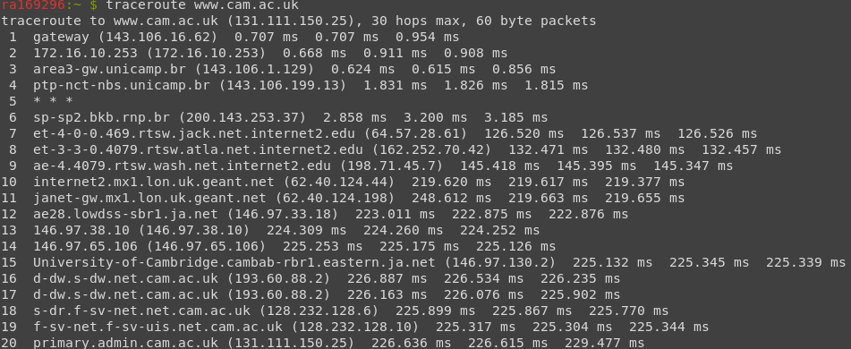

### 6. Netstat

6.1. É possível ver o tipo de protocolo estabelecido com o site, o endereço e porta e o estado da comunicação. No caso da Unicamp, o protocolo é TCP, o endereço e porta são "cerejeira.unicamp:https" e o estado da conexão é ESTABELECIDA. A comunicação é então feita entre a porta 56222 da máquina local com a porta HTTPS que por padrão é a 443.

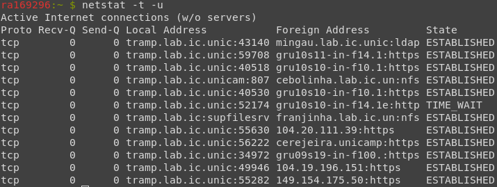

6.2. Há outras conexões TCP, suas informações podem ser vistas na tabela abaixo.
<div style="page-break-after: always;"></div>

|Endereços de Origem | Porta | Endereço de Destino | Porta |
|--------------------|-------|---------------------|-------|
|tramp.lab.ic.unic|43140| mingau.lab.ic.unic|ldap
|tramp.lab.ic.unic|59708| gru10s11-in-f14.1|https
|tramp.lab.ic.unic|40518| gru10s10-in-f10.1|https
|tramp.lab.ic.unicam|807| cebolinha.lab.ic.un|nfs
|tramp.lab.ic.unic|40530| gru10s10-in-f10.1|https
|tramp.lab.ic.unic|52174| gru10s10-in-f14.1e|http
|tramp.lab.ic|supfilesrv| franjinha.lab.ic.un|nfs
|tramp.lab.ic.unic|55630| 104.20.111.39|https
|tramp.lab.ic.unic|34972| gru09s19-in-f100.|https
|tramp.lab.ic.unic|49946| 104.19.196.151|https
|tramp.lab.ic.unic|55282| 149.154.175.50|https


### 7. Telnet

7.1. É possível, pois é um comando que utiliza o protocolo TCP e permite a conexão com um host remoto. Uma vez que o HTTP é uma conexão aberta, ele permite a conexão do Telnet sem a necessidade de autenticação.

7.2. Realizamos a conexão com o servidor www.pudim.com.br e requisitamos seu index.html:

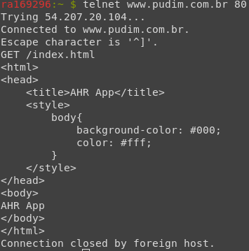
